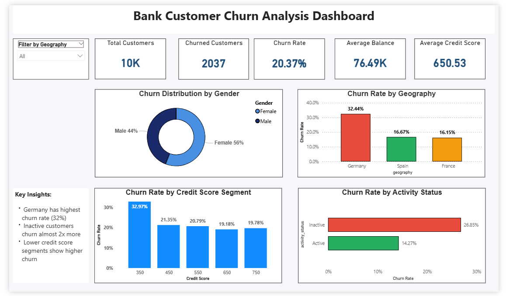

# Bank Customer Churn Analysis

## 📌 Project Overview
This project analyzes bank customer data to identify patterns and factors that influence customer churn.  
The analysis focuses on customer demographics, financial behavior, and account activity to help banks improve customer retention strategies.

---

## ❓ Business Problem
Banks face customer attrition which leads to revenue loss and increased customer acquisition costs.

The business wants to:
- Identify customers likely to churn
- Understand the impact of credit score, age, balance, and products on churn
- Analyze churn patterns across geographic regions
- Compare active vs inactive customer behavior

---

## 📂 Dataset
- Source: Kaggle (Bank Customer Churn Dataset)
- Format: Excel / CSV
- Records: 10,000+ customers

### Data Dictionary

| Column | Description |
|------|-------------|
| CustomerId | Unique customer identifier |
| CreditScore | Customer credit score |
| Geography | Country of customer |
| Gender | Male / Female |
| Age | Customer age |
| Tenure | Number of years with bank |
| Balance | Account balance |
| NumOfProducts | Number of bank products used |
| HasCrCard | Customer has credit card |
| IsActiveMember | Customer activity status |
| EstimatedSalary | Estimated annual salary |
| Exited | Customer churn status (1 = churned) |

---

## 🛠 Tools Used
- Excel – Data cleaning and preprocessing
- SQL – Data analysis and KPI calculation
- Power BI – Dashboard creation and visualization
- GitHub – Version control and project documentation

---

## 📊 Key KPIs
- Total Customers
- Total Churned Customers
- Churn Rate
- Active Member Ratio
- Average Customer Balance
- Average Credit Score

---

## 📈 Dashboard Preview

---

## 🚀 How to Run This Project

1. Clone the repository
2. Import dataset from `/data` into SQL database
3. Run SQL queries from `/sql`
4. Open Power BI dashboard from `/powerbi`
5. Refresh data and explore visual insights

---

## 📊 Key Insights
- Customers with **fewer bank products** showed higher churn probability.
- **Inactive members** were significantly more likely to leave the bank.
- Certain geographic regions had higher churn rates.
- Customers with **lower engagement levels** showed increased churn risk.

---

## 📌 Conclusion
This project demonstrates an end-to-end data analysis workflow including data cleaning, SQL-based analysis, KPI development, and interactive dashboard visualization using Power BI.

---

## 👤 Author
**Pavan Hatolkar**
